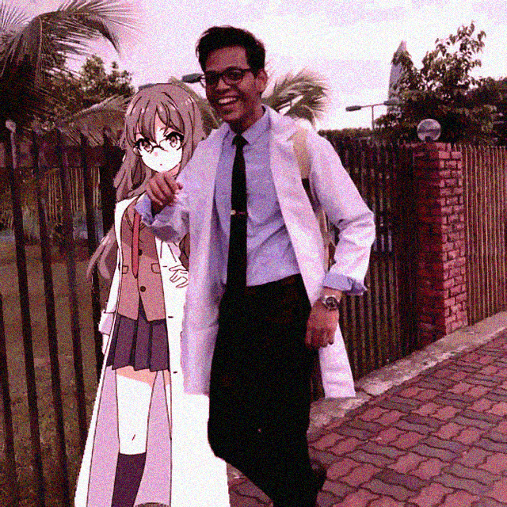

# sulaimanmhashim

Bismillah Assalamualaikum

I’m a Software Engineering Student in the Faculty of Computer Science and Information Technology in Universiti Malaya.

For the Semester 1 of 25/24 session the subjects I take includes:
- WIA3002 ACADEMIC PROJECT I
- WIF3005 SOFTWARE MAINTENANCE AND EVOLUTION
- WIF3006 COMPONENT-BASED SOFTWARE ENGINEERING
- WIF3008 REAL TIME SYSTEMS
- WIF3010 PROGRAMMING LANGUAGE PARADIGM
- GKA1001 ATTACH@INDUSTRY
- GKK1001 COMMUNITY SERVICE

Taking life one step at a time.

For this semester, I hope to be able to expand my knowledge further.
_____________________________________________________________________
Languages:
- Java
- Kotlin
- Python
- C#
- Godotscript
